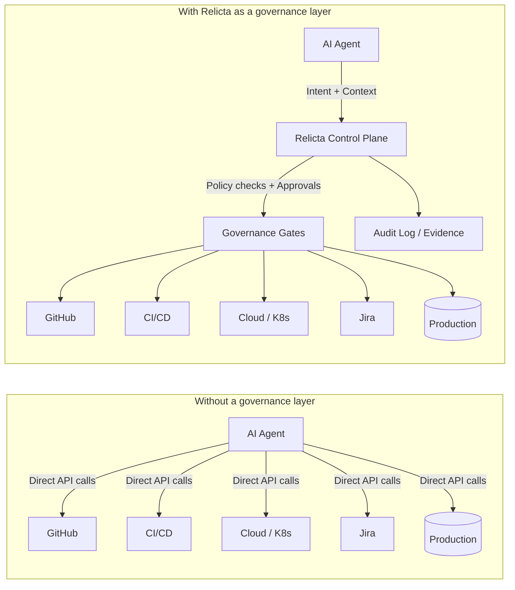

# Why AI Agents Need Permission  
## The case for a governance layer between agents and production

AI agents are rapidly moving from experimentation to execution.

They no longer just *suggest* code changes, release notes, or infrastructure updates. Increasingly, they **act**: creating pull requests, tagging releases, updating Jira tickets, deploying services, or modifying production configurations.

This shift marks a fundamental transition—from AI as an assistant to AI as an **operator**.

And that transition exposes a critical gap.

> We have given AI agents hands, but not boundaries.

At Relicta, we believe this gap will define the next era of AI adoption in engineering organizations.

---

## The uncomfortable truth: agents are powerful—and ungoverned

Modern AI agents can:

- Generate and merge code  
- Modify CI/CD pipelines  
- Trigger releases  
- Change configuration and feature flags  
- Interact with issue trackers, repos, cloud APIs, and internal tools  

They do this by chaining tools, APIs, and credentials—often with **broad permissions**, limited oversight, and little organizational context.

In many teams today:

- An agent has access because it *can*, not because it *should*  
- Approval is implicit, not explicit  
- Responsibility is blurred between human, system, and model  

This works—until it doesn’t.

### When something goes wrong, the questions become uncomfortable:

- Who approved this action?  
- Under which policy?  
- Was this change compliant?  
- Could this agent even do that?  
- How do we prevent it from happening again?  

These are not AI problems.  
They are **governance problems**.

---

## Humans operate with permission. AI agents often don’t.

In mature engineering organizations, *humans* operate within well-defined boundaries:

- Role-based access control (RBAC)  
- Change approval workflows  
- Release gates  
- Separation of duties  
- Audit trails  
- Compliance rules  

A junior engineer cannot:

- Push directly to production  
- Bypass security checks  
- Change billing or customer data  
- Release without approvals  

But many AI agents today effectively can.

Why?

Because we connected them directly to production systems—without inserting the same governance layer we rely on for humans.

---

## Why “just trusting the agent” does not scale

Early adopters often rely on informal safeguards:

- “The agent only runs in staging”  
- “We review PRs manually”  
- “It’s fine, it’s deterministic”  
- “We trust this model”  

This breaks down as:

- The number of agents grows  
- Agents become autonomous  
- Actions span teams, repos, and environments  
- Compliance and audit requirements kick in  
- Incidents become harder to trace  

Trust is not a control mechanism.  
Especially not at scale.

---

## The missing layer: permissioned execution

What’s missing is not better models.

What’s missing is a **governance layer between AI agents and production**.

A layer that answers one simple question before *any* action:

> *Is this agent allowed to do this, in this context, right now?*

At Relicta, we call this **permissioned execution**.

---

## What permission means for AI agents

Permission is not just “yes” or “no”.

In a production-grade environment, permission includes:

### 1) Scope
What can this agent act on?

- Repositories  
- Services  
- Environments  
- Product lines  
- Tenants  

### 2) Action types
What is it allowed to do?

- Read vs write  
- Propose vs execute  
- Deploy vs prepare  
- Modify config vs observe  

### 3) Context
Under which conditions?

- Business hours only  
- Certain release phases  
- Specific branches  
- Specific risk levels  

### 4) Approval
Who must sign off?

- Auto-approve  
- Human-in-the-loop  
- Multi-party approval  
- Policy-based approval  

### 5) Auditability
Can we answer, later:

- What happened?  
- Why it happened?  
- Who (or what) authorized it?  

Without these dimensions, AI agents are operating outside the rules that govern every other production actor.

---

# Relicta diagrams

Below are Relicta-specific diagrams you can render directly in Markdown using Mermaid (supported by many Astro setups via remark/rehype plugins or MDX).

---

## Diagram 1: Without governance vs. with Relicta

